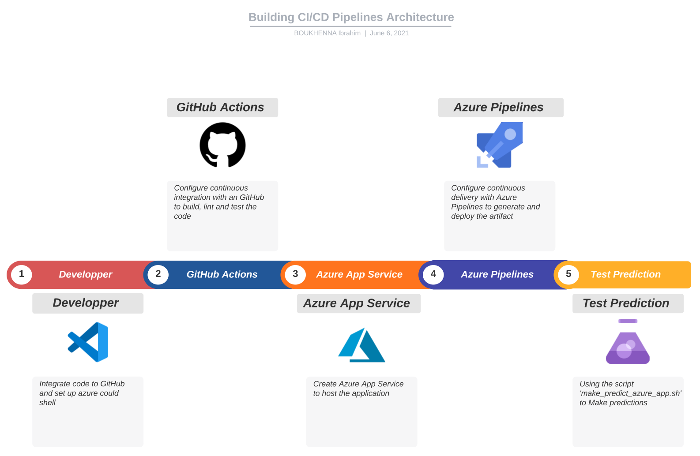

[](https://github.com/iBoukhenna/building-ci-cd-pipelines-repo/actions/workflows/main.yml)

# Overview

Setup CI/CD Pipeline for building a Python web application and deploying it using Azure App Services.


## Project Plan

* A [Trello board] https://trello.com/b/BucwyuFR/building-ci-cd-pipelines-board
* A [Spreadsheet] https://docs.google.com/spreadsheets/d/1FLLO2Nj3flrCCnwPlZ-Jfr4BK13s3Km-g0BMFW-FouU/edit?usp=sharing


## Instructions

* Architectural Diagram



* Screenshot of a GitHub Actions build


* Launch Azure Cloud Shell


* Generate SSH key

```
ssh-keygen -t rsa
```

* Upload public key to github


* Clone the repository using Azure Cloud Shell

```
git clone git@github.com:iBoukhenna/building-ci-cd-pipelines-repo.git
```

* Change into the new directory

```
cd building-ci-cd-pipelines-repo
```


* Create a new python virtual environnement

```
python -m venv building-ci-cd-pipelines-venv
```

* Activate the virtual environment

```
. building-ci-cd-pipelines-venv/bin/activate
```


* Install dependencies and build the app

```
make all
```


* Start the application in the local environment

```
python app.py
```


* Open a separate Cloud Shell and test that the app is working

```
./make_prediction.sh
```


* Create Azure App Service

```
az webapp up --sku F1 -n building-ci-cd-pipelines-asa
```


* Create the Pipeline in Azure DevOps

1. Go to https://dev.azure.com and sign in.
2. Create a new private project.
3. Under Project Settings create a new service connection and select Azure Resource Manager.
4. Create a Python-specific pipeline to deploy to App Service, and select your GitHub repo.


* Screenshot of a successful run of the project in Azure Pipelines


* Get app logs

```
az webapp log tail
```


* Test the app is up and running

```
./make_predict_azure_app.sh
```


* Output of streamed log files


* We can also use locust to do a load test of the app running locall, for that install locust

```
pip install locust
```

* Run the app

```
python app.py
```

* Start locust

```
locust
```

1. Open a browser and go to http://localhost:8089.
2. Enter the total number of users to simulate and spawn rate.
3. Set the host to localhost:5000 and click Start Swarming.


* You can then watch the load test:


4. Open a new tab in browser and go to http://localhost:8089.
5. Enter the total number of users to simulate and spawn rate.
6. Set the host with the link of azure webapp https://building-ci-cd-pipelines-asa.azurewebsites.net:5000 and click Start Swarming.


* You can then watch the load test:


## Enhancements

Add develop branch for developement envirenement if it works correctly the changes could then be merged in master branch and deployed in production envirenement.

## Demo

* A [YouTube Demo] : https://www.youtube.com/watch?v=qrGhEAtVnI4
